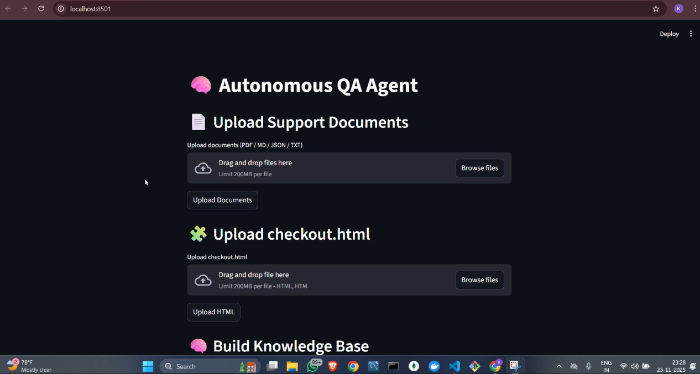

# 🚀 Autonomous QA Agent

An intelligent QA automation assistant that reads your product documents, understands UI structure, and automatically generates:

✔ Test Cases  
✔ Selenium Automation Scripts  
✔ Document-grounded Contextual Answers  

Built using **FastAPI**, **Streamlit**, **OpenAI/Ollama**, and a lightweight RAG pipeline.

---

## 📸 Project Screenshot

Below is a **sample image** representing the UI of the QA Agent:

---

## 🧠 Features

### 🔍 Document-Aware Test Case Generation
Reads:
- `product_specs.md`
- `ui_ux_guide.txt`
- `api_endpoints.json`
- `checkout.html`

Builds a Knowledge Base → generates **accurate test cases** grounded in your documentation.

### 🤖 Automated Selenium Script Generation
Uses:
- HTML structure  
- Retrieved document context  
- Selected test case  

Generates a **fully runnable Selenium Python script** with correct locators.

### 🏗️ Backend – FastAPI
Endpoints:
- `/upload_document`
- `/upload_html`
- `/build_kb`
- `/generate_test_cases`
- `/generate_selenium`

### 🎨 Frontend – Streamlit
Provides an interactive web interface for uploading docs and generating outputs.

---

## 📂 Project Structure

